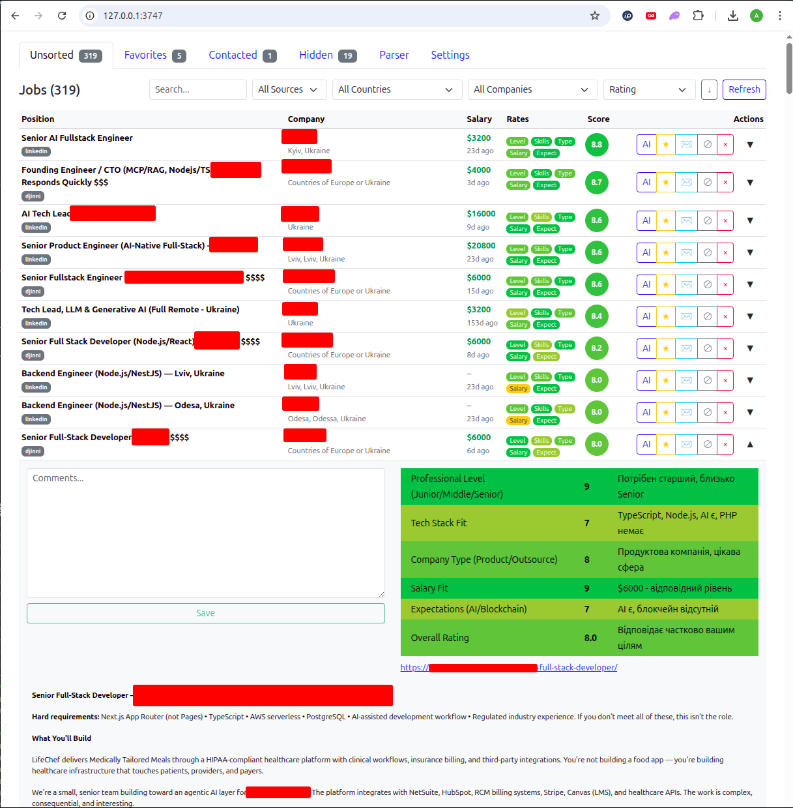

# AI Job Analyzer

A single-page tool for collecting, storing, and AI-rating job vacancies from DOU.ua, Djinni.co, and LinkedIn.

**Local URL:** http://127.0.0.1:3747/



---

## How it works

1. **Parse** — fetch vacancies directly by URL (DOU, Djinni) or paste a JSON scraped from LinkedIn
2. **Save** — vacancies are stored locally in the browser's IndexedDB (no backend storage)
3. **Analyze** — send each vacancy to OpenAI and get a structured rating based on your candidate profile
4. **Manage** — move vacancies between tabs: Unsorted → Favorites → Contacted → Hidden

---

## AI Rating

Each vacancy is scored 1–10 across five dimensions:

| Field | Description |
|---|---|
| **Level** | Seniority fit (junior/middle/senior) |
| **Skills** | Tech stack match |
| **Type** | Company type fit (product / outsource) |
| **Salary** | Salary match |
| **Expect** | Fit with your preferred domains and priorities |
| **Total** | Overall score (0.0 – 10.0) |

Configure your candidate profile in the **Settings** tab before running analysis.

---

## Stack

- **Frontend:** React, Bootstrap 5, IndexedDB (`idb`), Vite
- **Backend:** Node.js, Express
- **AI:** OpenAI API (`gpt-4.1-mini`)

---

## Quick start

### Docker (recommended)

```bash
cp .env.example .env
# add your OPENAI_API_KEY to .env

make build
make up
```

Open http://127.0.0.1:3747/

### Local development

```bash
cp .env.example .env
# add your OPENAI_API_KEY to .env

make install
make dev
```

- Frontend (Vite): http://127.0.0.1:5173/
- Backend (Express): http://127.0.0.1:3747/

---

## Make commands

| Command | Description |
|---|---|
| `make build` | Build Docker image |
| `make up` | Start container in background |
| `make down` | Stop container |
| `make restart` | Restart container |
| `make logs` | Stream container logs |
| `make install` | Install npm dependencies (client + server) |
| `make dev` | Run local dev servers |

---

## Project structure

```
├── client/               # Vite + React frontend
│   └── src/
│       ├── api/          # Server API calls (fetch proxy, AI)
│       └── features/
│           └── ai-job/   # Main feature: components, parsers, services
├── server/               # Express backend
│   └── src/
│       ├── ai/           # OpenAI agent
│       ├── controllers/  # fetch proxy, AI endpoint
│       └── routes/
├── config/               # AI prompt templates
│   ├── promptMain.js     # System prompt with rating instructions
│   └── promptDefault.js  # Default candidate profile placeholder
├── Dockerfile
├── docker-compose.yml    # Port 3747
└── Makefile
```

---

## Environment variables

| Variable | Description |
|---|---|
| `OPENAI_API_KEY` | OpenAI API key |
| `PORT` | Server port (default: `3747`) |
